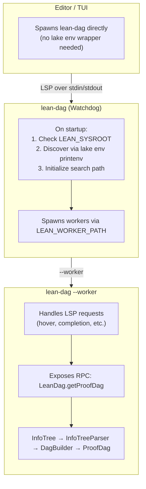

# LeanDag

An LSP server extension for Lean 4 that exposes proof structure via RPC.

## Build

```bash
lake build lean-dag
```

## Test

```bash
lake test
```

## How It Works


```mermaid
flowchart TB
    subgraph Editor["Editor / TUI"]
        spawn["Spawns lean-dag directly<br/>(no lake env wrapper needed)"]
    end

    subgraph Watchdog["lean-dag (Watchdog)"]
        direction TB
        init["On startup:<br/>1. Check LEAN_SYSROOT<br/>2. Discover via lake env printenv<br/>3. Initialize search path"]
        spawnWorker["Spawns workers via LEAN_WORKER_PATH"]
        init --> spawnWorker
    end

    subgraph Worker["lean-dag --worker"]
        direction TB
        lsp["Handles LSP requests<br/>(hover, completion, etc.)"]
        rpc["Exposes RPC: LeanDag.getProofDag"]
        pipeline["InfoTree → InfoTreeParser → DagBuilder → ProofDag"]
        lsp --> rpc
        rpc --> pipeline
    end

    Editor -->|"LSP over stdin/stdout"| Watchdog
    Watchdog -->|"--worker"| Worker
```
