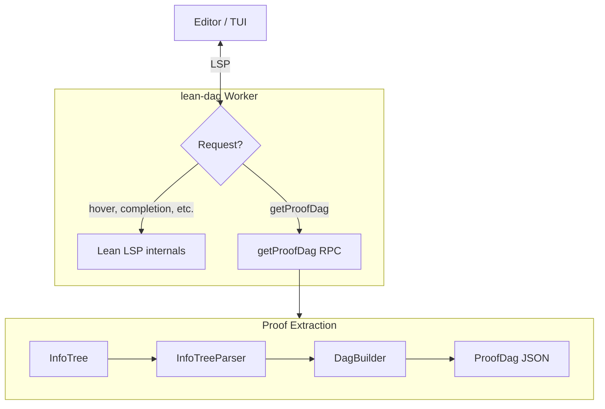

# LeanDag

An LSP server extension for Lean 4 that exposes proof structure via RPC.

## Build

```bash
lake build lean-dag
```

## Test

```bash
lake test
```

## How It Works



How it works:

- `lean-dag` is a full Lean LSP server (watchdog + workers)
- Standard LSP requests (hover, completion, diagnostics) are handled by Lean's built-in LSP
- The custom `getProofDag` RPC extracts proof structure from Lean's InfoTree
