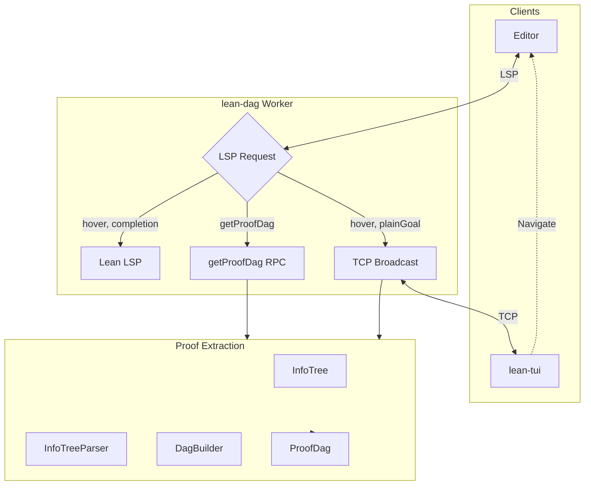

# Lean DAG

An RPC method extension for the built-in [Lean](https://lean-lang.org/) RPC server. You are supposed to import `LeanDag` in you `lakefile.toml` like this:

```toml
[[require]]
name = "LeanDag"
git = "https://github.com/wvhulle/lean-dag.git"
rev = "main"
```

In combination with another front-end like [`lean-tui`](https://codeberg.org/wvhulle/lean-tui) you can use it to have a custom view on your proof state as a [directed acyclic graph (DAG)](https://en.wikipedia.org/wiki/Directed_acyclic_graph).

The format of the RPC-JSON sent out by this RPC server method is documented in [./protocol-schema.json](./protocol-schema.json). It can be used for automatic code-generation of safe APIs (in Rust, JavaScript or other languages that support this).


